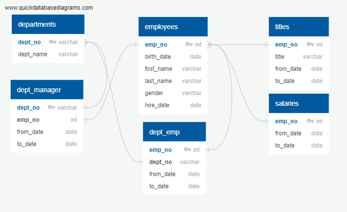

# Pewlett Hackard Analysis

Pewlett Hackard provided several datasets so we could execute different analyses and determine the number of employees who will likely be retiring soon and which departments will be losing staff and/or managers. I was provided data on current departments and employees, including hiring dates, retirement/termination dates, salaries, and job titles, via six .csv files.

To provide Pewlett Hackard with the analysis they were looking for, I built a Postgres database and used SQL to analyze the .csv files. Before performing any analysis, I built an ERD (see below) to represent the relationships between the data in the individual datasets. Once the ERD was saved, I used SQL to physically establish the relationships that I had mapped out in the ERD. I used prompts like CREATE TABLE, FOREIGN KEY / REFERENCES, and PRIMARY KEY to load the given .csv files into their databases and connect them. Once the given .csv files were loaded, I used the SELECT / INTO commands to parce out the pertinent information for new databases that provided deeper analysis based on the information Pewlett Hackard needed. 

Figure: ERD

The analysis indicates that the following number of employees will likely retire soon from each department: 2,199 from Marketing; 1,908 from Finance; 1,953 from Human Resources; 8,174 from Production; 9,281 from Development; 2,234 from Quality Management; 5,860 from Sales; 2,413 from Research; and 2,597 from Customer Service. The limitations I found in performing this analysis is that I do not know if the columns with the same header are truly representing the same data. For example, there is a "to_date" and "from_date" in the "salaries" and "titles" files. I am unclear if the salaries dates represent how long a particular employee was paid at that salary, or if the dates represent the hire/termination dates like it does in the "employees" database. Likewise for the "titles" file, I do not know if the dates represent the hire/termination dates or how long an employee held that title. This confusion could lead to errors in evaluating which positions will be opening up suring the "silver tsunami." The steps I would recommend to clarify would be to either ask the data source directly, or to perform an analysis that shows if an employee appears more than once in either the "salaraies" or "titles" datasets. If they appear multiple times in one dataset, then that indicates that the dates are attached to the title/salary, and not the employees overall employment dates.
